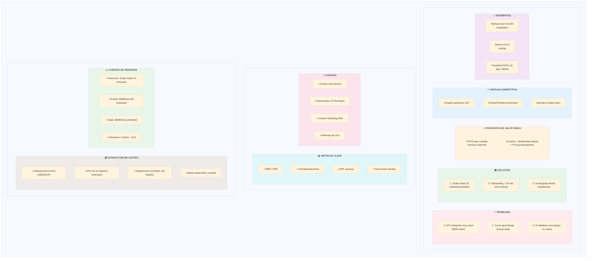
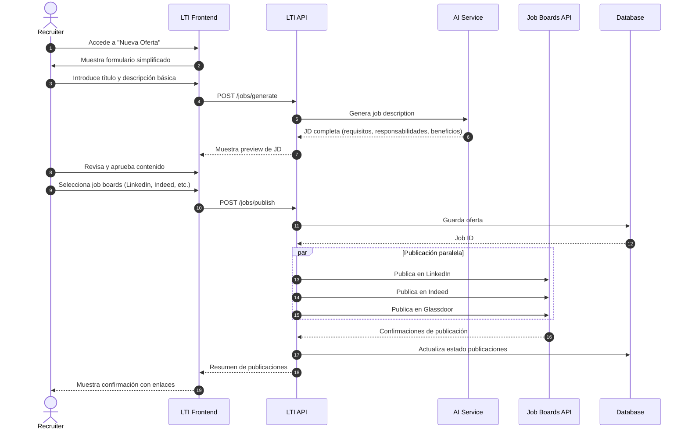
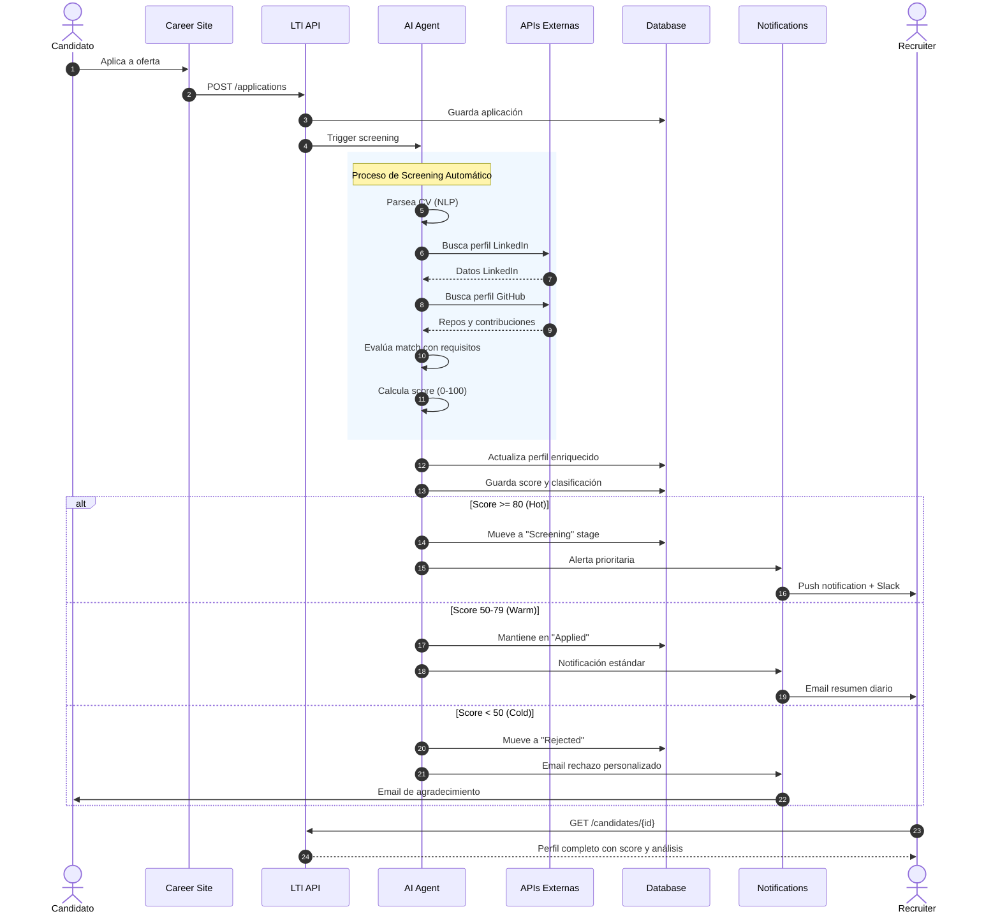
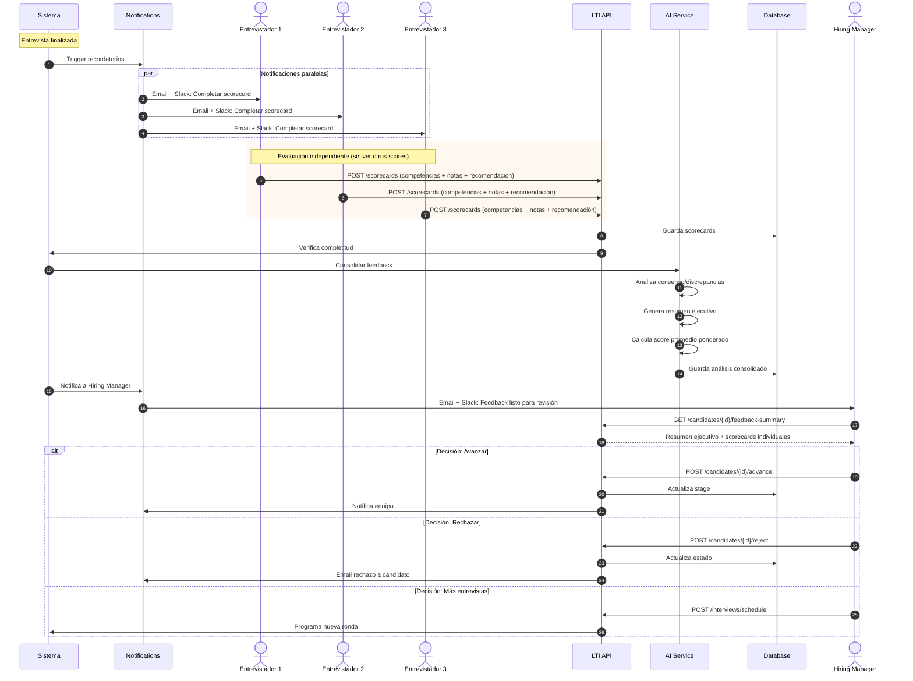
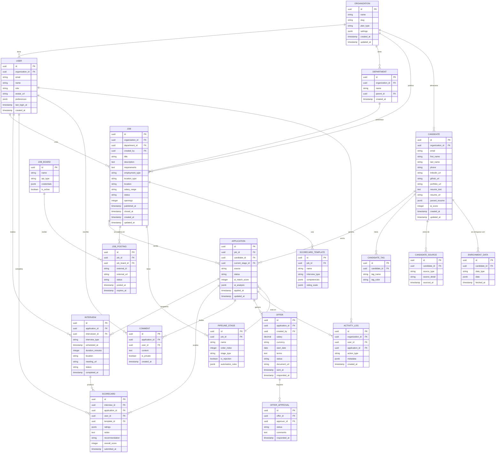
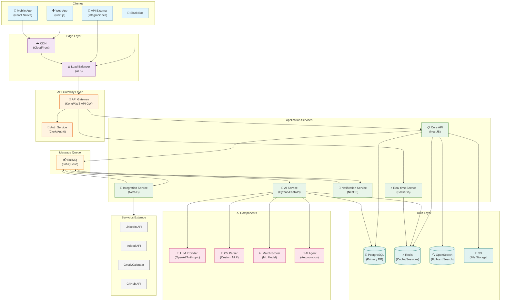
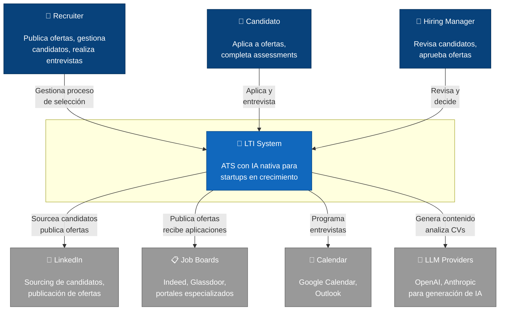
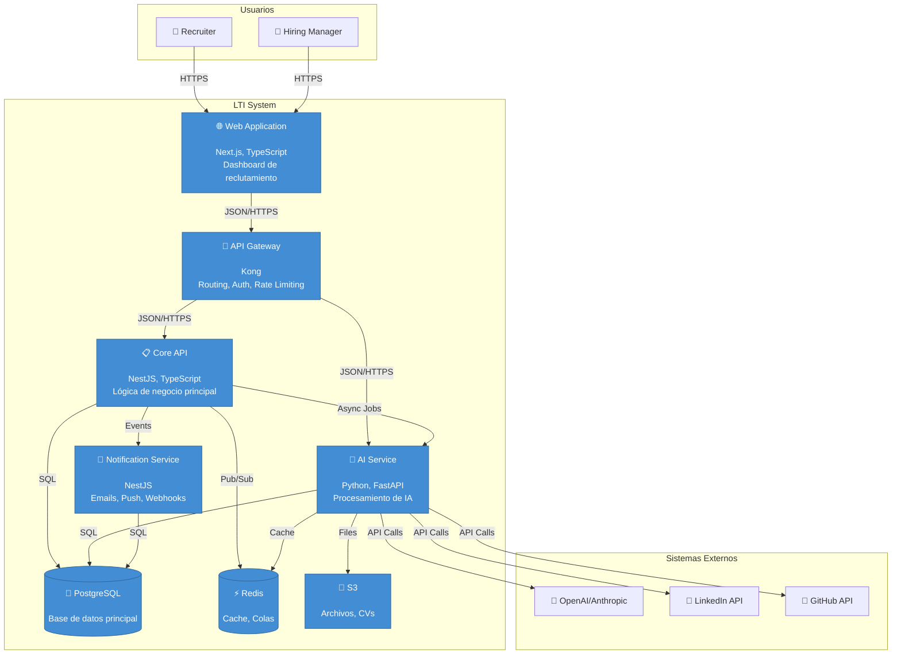
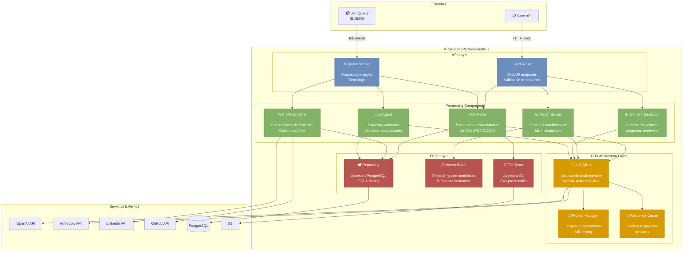

# LTI - Applicant Tracking System del Futuro para Startups

## Índice

1. [Descripción del Software](#1-descripción-del-software)
2. [Funciones Principales](#2-funciones-principales)
3. [Lean Canvas](#3-lean-canvas)
4. [Casos de Uso Principales](#4-casos-de-uso-principales)
5. [Modelo de Datos](#5-modelo-de-datos)
6. [Diseño del Sistema a Alto Nivel](#6-diseño-del-sistema-a-alto-nivel)
7. [Diagrama C4 - Componente de IA](#7-diagrama-c4---componente-de-ia)

---

## 1. Descripción del Software

### ¿Qué es LTI?

**LTI (Leading Talent Intelligence)** es un Applicant Tracking System (ATS) de nueva generación diseñado específicamente para startups en fase de crecimiento. A diferencia de los ATS tradicionales que fueron construidos para grandes corporaciones y luego simplificados, LTI nace desde cero con la mentalidad startup: simplicidad radical, IA nativa y pricing transparente.

### Valor Añadido

LTI resuelve los tres problemas fundamentales que enfrentan las startups al contratar:

1. **Tiempo escaso**: Los founders y equipos pequeños no pueden dedicar horas a aprender sistemas complejos. LTI ofrece onboarding en menos de 30 minutos con una interfaz que no requiere formación.

2. **Presupuesto limitado**: Mientras los ATS enterprise cuestan $35,000+/año, LTI es gratuito hasta 10 contrataciones anuales y escala con el éxito de la empresa, no con el número de usuarios.

3. **Competencia por talento tech**: Las startups compiten contra Google y Meta por los mismos desarrolladores. LTI nivela el campo con herramientas de IA que automatizan el sourcing, personalizan el outreach y optimizan cada etapa del funnel.

### Ventajas Competitivas

| Característica | LTI | Greenhouse | Lever | Workable |
|----------------|-----|------------|-------|----------|
| **Onboarding** | < 30 min | Semanas | Días | Días |
| **Precio inicial** | Gratis | $6,500/año | Custom | $299/mes |
| **IA nativa** | ✅ Integrada | ❌ Plugins | ❌ Básica | ❌ Add-on |
| **Pricing transparente** | ✅ Público | ❌ Llamada ventas | ❌ Llamada ventas | ✅ Público |
| **Mobile-first** | ✅ Completo | ⚠️ Limitado | ⚠️ Limitado | ⚠️ Limitado |
| **Slack nativo** | ✅ Workflow completo | ⚠️ Notificaciones | ⚠️ Notificaciones | ⚠️ Notificaciones |

**Diferenciadores únicos de LTI:**

- **AI Agent 24/7**: Mientras el equipo duerme, el agente de IA sourcea candidatos, envía mensajes personalizados y programa screenings iniciales.
- **GitHub/Portfolio Import**: Enriquecimiento automático de perfiles técnicos con análisis de repositorios y proyectos.
- **Interview Copilot**: Sugerencias de preguntas en tiempo real durante entrevistas basadas en el CV y respuestas anteriores.
- **Candidate Rediscovery**: IA que automáticamente resurface candidatos pasados cuando abres un nuevo rol compatible.
- **One-Click Job Post**: La IA genera la descripción del puesto y la publica en 15+ job boards simultáneamente.

---

## 2. Funciones Principales

### 2.1 Gestión de Ofertas de Empleo

**Creación asistida por IA**: El usuario describe el rol en lenguaje natural y la IA genera una job description optimizada para SEO y conversión, incluyendo requisitos, responsabilidades, beneficios y cultura.

**Multi-posting automático**: Publicación simultánea en LinkedIn, Indeed, Glassdoor, Stack Overflow Jobs, AngelList, y job boards especializados por sector.

**Career Site Builder**: Constructor drag-and-drop de páginas de carreras con templates modernos, testimonios de empleados auto-generados y analytics de conversión.

### 2.2 Sourcing Inteligente

**AI Agent de Sourcing**: Agente autónomo que busca candidatos en LinkedIn, GitHub, Stack Overflow y otras fuentes 24/7, evaluando fit técnico y cultural.

**Outreach Personalizado**: Generación automática de mensajes de contacto que mencionan proyectos específicos del candidato, papers publicados o contribuciones open source.

**Talent Pool CRM**: Base de datos de candidatos pasados con nurturing automatizado, scoring dinámico y alertas de disponibilidad.

### 2.3 Pipeline de Candidatos

**Kanban Visual**: Vista de pipeline drag-and-drop con stages personalizables por rol (Applied → Screening → Technical → Culture → Offer → Hired).

**Automatizaciones**: Workflows configurables que mueven candidatos, envían emails, notifican al equipo y programan entrevistas automáticamente.

**Bulk Actions**: Acciones masivas sobre candidatos con filtros avanzados (rechazar, mover stage, enviar template, añadir tags).

### 2.4 Evaluación y Entrevistas

**Scorecards Estructurados**: Templates de evaluación por competencias con escalas configurables, campos de evidencia y recomendación final.

**Interview Scheduling**: Self-scheduling para candidatos con disponibilidad del equipo, integración con Google Calendar/Outlook y recordatorios automáticos.

**Interview Copilot**: Durante la entrevista, sugerencias de preguntas follow-up basadas en respuestas, gaps detectados en CV y criterios del scorecard.

**Video Interviews**: Entrevistas asíncronas con preguntas predefinidas, límites de tiempo y transcripción automática con análisis de IA.

### 2.5 Colaboración en Tiempo Real

**Slack/Teams Native**: Workflow completo sin salir del chat - aprobar candidatos, ver CVs resumidos, dar feedback, recibir alertas.

**Feedback Consolidado**: La IA sintetiza todos los scorecards en un resumen ejecutivo con fortalezas, debilidades y recomendación.

**Hiring Manager Portal**: Vista simplificada para managers no-recruiters con acciones one-click y dashboards de sus posiciones.

**@Mentions y Comentarios**: Comunicación contextual en cada candidato con historial completo y notificaciones inteligentes.

### 2.6 Analytics y Reporting

**Dashboard en Tiempo Real**: Métricas clave (time-to-hire, source effectiveness, pipeline velocity, offer acceptance rate) con comparativas históricas.

**Funnel Analytics**: Análisis de conversión por stage, identificación de cuellos de botella y predicciones de tiempo de contratación.

**DE&I Reporting**: Métricas de diversidad en pipeline con anonymización opcional y detección de bias en proceso.

**Custom Reports**: Builder de reportes con filtros avanzados, exportación a Excel/PDF y scheduling de envío automático.

### 2.7 Ofertas y Onboarding

**Offer Management**: Templates de cartas de oferta con variables dinámicas, firma electrónica integrada y tracking de estado.

**Salary Benchmarking**: Datos de mercado integrados con recomendaciones de rango salarial por rol, ubicación y seniority.

**Pre-boarding**: Checklist automatizado post-aceptación con documentación, accesos y welcome package.

---

## 3. Lean Canvas



### Explicación del Lean Canvas

**Problema**: El mercado de ATS tiene menos del 50% de satisfacción. Las startups enfrentan herramientas caras diseñadas para enterprises, interfaces complejas que requieren semanas de training, y funcionalidades de IA que son plugins superficiales sin integración real.

**Solución**: LTI ataca cada problema directamente con modelo freemium agresivo, UX obsesivamente simple, e IA como ciudadano de primera clase en la arquitectura.

**Propuesta de Valor Única**: "El ATS que contrata mientras duermes" captura la esencia del AI Agent autónomo que sourcea, contacta y pre-filtra candidatos 24/7.

**Ventaja Competitiva**: Ningún competidor ofrece simultáneamente un agente de IA autónomo, integración profunda con ecosistemas de desarrollo (GitHub), y asistencia en tiempo real durante entrevistas.

**Segmentos**: Focus láser en startups tech en fase de scaling donde cada contratación es crítica y los recursos de HR son limitados o inexistentes.

**Métricas Clave**: MRR como norte financiero, contrataciones exitosas como métrica de valor entregado, NPS para product-market fit, y time-to-hire de clientes como prueba de eficacia.

**Canales**: Go-to-market product-led con virality en comunidades startup (Product Hunt, YC, Techstars) complementado con content marketing para SEO.

**Estructura de Costes**: Modelo SaaS típico con costes variables por uso de APIs de IA y fijos de infraestructura y equipo.

**Fuentes de Ingresos**: Freemium para adquisición, tiers claros por volumen de contratación, y enterprise para grandes cuentas con necesidades custom.

---

## 4. Casos de Uso Principales

### 4.1 Caso de Uso 1: Publicación de Oferta de Empleo con IA

**Actor Principal**: Recruiter / Hiring Manager

**Descripción**: El usuario necesita publicar una nueva oferta de empleo. En lugar de escribir manualmente la job description y publicarla en cada job board individualmente, utiliza el sistema de IA de LTI para generar el contenido y publicar automáticamente en múltiples plataformas.

**Precondiciones**:
- Usuario autenticado con permisos de creación de ofertas
- Al menos un departamento configurado en el sistema
- Integraciones con job boards activas

**Flujo Principal**:
1. Usuario accede a "Nueva Oferta"
2. Usuario introduce título del puesto y descripción básica en lenguaje natural
3. Sistema genera job description completa con IA (requisitos, responsabilidades, beneficios)
4. Usuario revisa y edita el contenido generado
5. Usuario selecciona job boards de destino
6. Sistema publica simultáneamente en todos los canales seleccionados
7. Sistema confirma publicación y muestra enlaces

**Flujos Alternativos**:
- 3a. Usuario no está satisfecho con la generación → Regenera con instrucciones adicionales
- 5a. Integración con job board falla → Sistema notifica y permite reintentar
- 6a. Usuario quiere programar publicación → Sistema permite fecha/hora futura

**Postcondiciones**:
- Oferta activa en el sistema y visible en career site
- Publicaciones activas en job boards seleccionados
- Pipeline de candidatos creado para la oferta



---

### 4.2 Caso de Uso 2: Screening Automatizado de Candidatos

**Actor Principal**: Sistema (AI Agent) / Recruiter (supervisión)

**Descripción**: Cuando llegan nuevas aplicaciones, el AI Agent de LTI analiza automáticamente los CVs, evalúa el fit con los requisitos del puesto, enriquece los perfiles con datos externos (GitHub, LinkedIn), y pre-filtra candidatos clasificándolos por prioridad. El recruiter supervisa y puede ajustar las decisiones del sistema.

**Precondiciones**:
- Oferta de empleo activa con requisitos definidos
- AI Agent de screening activado para la oferta
- Permisos de auto-screening configurados

**Flujo Principal**:
1. Candidato aplica a través de career site o job board
2. Sistema recibe aplicación y CV
3. AI Agent parsea CV extrayendo datos estructurados
4. AI Agent busca perfiles públicos del candidato (LinkedIn, GitHub)
5. AI Agent evalúa match con requisitos del puesto
6. Sistema clasifica candidato (Hot/Warm/Cold) y asigna score
7. Sistema mueve candidato al stage correspondiente del pipeline
8. Sistema notifica al recruiter de candidatos prioritarios

**Flujos Alternativos**:
- 3a. CV en formato no soportado → Sistema solicita re-upload
- 4a. No se encuentran perfiles públicos → Continúa solo con datos del CV
- 6a. Score bajo umbral → Sistema rechaza automáticamente con email personalizado
- 8a. Candidato Hot → Sistema programa screening call automáticamente

**Postcondiciones**:
- Candidato en pipeline con score y clasificación
- Perfil enriquecido con datos externos
- Recruiter notificado si es candidato prioritario
- Métricas de funnel actualizadas



---

### 4.3 Caso de Uso 3: Evaluación Colaborativa Post-Entrevista

**Actor Principal**: Entrevistadores (múltiples) / Hiring Manager

**Descripción**: Después de una ronda de entrevistas, múltiples entrevistadores deben completar sus scorecards de forma independiente. El sistema consolida el feedback, la IA genera un resumen ejecutivo con análisis de consenso/discrepancias, y el hiring manager toma la decisión final de avanzar o rechazar al candidato.

**Precondiciones**:
- Entrevista completada con múltiples entrevistadores
- Scorecards configurados para el tipo de entrevista
- Todos los entrevistadores con acceso al sistema

**Flujo Principal**:
1. Sistema envía recordatorio post-entrevista a entrevistadores
2. Cada entrevistador accede a su scorecard pendiente
3. Entrevistador completa evaluación por competencias
4. Entrevistador añade notas y recomendación final
5. Sistema detecta cuando todos los scorecards están completos
6. AI consolida feedback y genera resumen ejecutivo
7. Sistema notifica al Hiring Manager
8. Hiring Manager revisa resumen y toma decisión
9. Sistema actualiza estado del candidato y notifica al equipo

**Flujos Alternativos**:
- 2a. Entrevistador no completa en 24h → Sistema envía recordatorio
- 4a. Evaluaciones muy discrepantes → Sistema alerta para calibración
- 8a. Hiring Manager solicita entrevista adicional → Sistema programa nueva ronda
- 8b. Decisión es avanzar → Sistema genera y envía oferta

**Postcondiciones**:
- Scorecards completos y consolidados
- Resumen ejecutivo disponible
- Candidato movido al siguiente stage o rechazado
- Historial de decisión documentado para compliance



---

## 5. Modelo de Datos

### 5.1 Diagrama Entidad-Relación



### 5.2 Descripción de Entidades

#### Entidades Principales

| Entidad | Descripción | Atributos Clave |
|---------|-------------|-----------------|
| **ORGANIZATION** | Empresa cliente de LTI (tenant) | id, name, slug, plan_type, settings |
| **USER** | Usuario del sistema (recruiter, hiring manager, admin) | id, email, name, role, organization_id |
| **DEPARTMENT** | Departamento/área de la organización | id, name, organization_id, parent_id |
| **JOB** | Oferta de empleo/posición abierta | id, title, description, status, department_id |
| **CANDIDATE** | Persona que aplica o es sourceada | id, email, name, resume, ai_score |
| **APPLICATION** | Candidatura de un candidato a un job específico | id, job_id, candidate_id, status, ai_match_score |

#### Entidades de Proceso

| Entidad | Descripción | Atributos Clave |
|---------|-------------|-----------------|
| **PIPELINE_STAGE** | Etapa del proceso de selección | id, job_id, name, order_index, automation_rules |
| **INTERVIEW** | Entrevista programada | id, application_id, interviewer_id, scheduled_at, status |
| **SCORECARD** | Evaluación de entrevista completada | id, interview_id, ratings, recommendation, overall_score |
| **SCORECARD_TEMPLATE** | Plantilla de evaluación por tipo de entrevista | id, job_id, competencies, rating_scale |
| **OFFER** | Oferta de trabajo generada | id, application_id, salary, status, document_url |
| **OFFER_APPROVAL** | Aprobación requerida para oferta | id, offer_id, approver_id, status |

#### Entidades de Soporte

| Entidad | Descripción | Atributos Clave |
|---------|-------------|-----------------|
| **JOB_BOARD** | Integración con portal de empleo externo | id, name, api_type, credentials |
| **JOB_POSTING** | Publicación de job en job board específico | id, job_id, job_board_id, external_url, status |
| **COMMENT** | Comentario/nota en una aplicación | id, application_id, user_id, content, is_private |
| **CANDIDATE_TAG** | Etiqueta asignada a candidato | id, candidate_id, tag_name, tag_color |
| **CANDIDATE_SOURCE** | Origen del candidato | id, candidate_id, source_type, source_detail |
| **ENRICHMENT_DATA** | Datos externos enriquecidos (LinkedIn, GitHub) | id, candidate_id, data_type, data |
| **ACTIVITY_LOG** | Registro de actividad para auditoría | id, action_type, user_id, application_id, metadata |

### 5.3 Relaciones Principales

1. **Organization → Users/Jobs/Candidates**: Multi-tenancy donde cada organización tiene sus propios datos aislados.

2. **Job → Applications → Candidate**: Una oferta recibe múltiples aplicaciones, cada una vinculada a un candidato. Un candidato puede tener múltiples aplicaciones (a diferentes jobs).

3. **Application → Pipeline_Stage**: Cada aplicación está en exactamente una etapa del pipeline en un momento dado.

4. **Application → Interviews → Scorecards**: Una aplicación puede tener múltiples entrevistas, y cada entrevista produce uno o más scorecards (uno por entrevistador).

5. **Job → Scorecard_Templates**: Cada job tiene templates de scorecard configurados para diferentes tipos de entrevista (technical, cultural, etc.).

6. **Candidate → Enrichment_Data**: Un candidato puede tener múltiples registros de enriquecimiento de diferentes fuentes (LinkedIn, GitHub, etc.).

---

## 6. Diseño del Sistema a Alto Nivel

### 6.1 Descripción de la Arquitectura

LTI sigue una arquitectura de **microservicios moderada** con un **API Gateway** como punto de entrada único. Esta decisión balancea la simplicidad de un monolito (apropiada para una startup) con la flexibilidad de escalar componentes críticos de forma independiente.

**Principios arquitectónicos:**

1. **API-First**: Toda funcionalidad se expone a través de APIs RESTful documentadas, permitiendo integraciones y un frontend desacoplado.

2. **Event-Driven para procesos asíncronos**: Operaciones como parsing de CVs, enriquecimiento de datos y notificaciones se manejan mediante colas de mensajes.

3. **Multi-tenancy con Row Level Security**: Base de datos compartida con aislamiento a nivel de fila usando políticas de PostgreSQL.

4. **Separation of Concerns**: El AI Service es independiente para poder escalar según demanda y actualizar modelos sin afectar el core.

**Componentes principales:**

- **API Gateway**: Autenticación, rate limiting, routing y logging centralizado.
- **Core API**: Lógica de negocio principal (jobs, candidates, applications, interviews).
- **AI Service**: Procesamiento de IA (parsing CVs, scoring, generación de contenido, AI Agent).
- **Integration Service**: Conexiones con sistemas externos (job boards, calendarios, HRIS).
- **Notification Service**: Gestión de emails, push notifications y webhooks.
- **Real-time Service**: WebSockets para actualizaciones en tiempo real y colaboración.

### 6.2 Diagrama de Arquitectura



### 6.3 Descripción de Componentes

#### Frontend Layer
- **Web App (Next.js)**: SPA con SSR para SEO en career sites. Dashboard principal para recruiters.
- **Mobile App (React Native)**: Versión móvil para gestión on-the-go, notificaciones push, quick actions.
- **Slack Bot**: Interfaz conversacional para aprobar candidatos, dar feedback, recibir alertas.

#### Edge Layer
- **CDN (CloudFront)**: Caché de assets estáticos, career sites, y respuestas de API frecuentes.
- **Load Balancer (ALB)**: Distribución de tráfico, health checks, terminación SSL.

#### Gateway Layer
- **API Gateway**: Punto de entrada único. Rate limiting por tenant, logging centralizado, routing.
- **Auth Service**: Autenticación (email, Google, SSO SAML), gestión de sesiones, RBAC.

#### Application Services
- **Core API**: CRUD de entidades principales, lógica de negocio, validaciones, permisos.
- **AI Service**: Procesamiento de IA aislado para escalar independientemente.
- **Integration Service**: Conectores con sistemas externos, manejo de webhooks entrantes/salientes.
- **Notification Service**: Templates de email, envío multicanal, preferencias de usuario.
- **Real-time Service**: WebSockets para actualizaciones live, presencia, colaboración.

#### Data Layer
- **PostgreSQL**: Base de datos principal con Row Level Security para multi-tenancy.
- **Redis**: Cache de sesiones, rate limiting, pub/sub para real-time.
- **OpenSearch**: Búsqueda full-text de candidatos, jobs, notas.
- **S3**: Almacenamiento de CVs, documentos, archivos adjuntos.

#### Message Queue
- **BullMQ**: Cola de trabajos para procesos asíncronos (parsing, emails, integraciones).

---

## 7. Diagrama C4 - Componente de IA

He seleccionado el **AI Service** para el diagrama C4 en profundidad porque es el componente más diferenciador y complejo de LTI.

### 7.1 C4 - Nivel 1: Contexto del Sistema



### 7.2 C4 - Nivel 2: Contenedores



### 7.3 C4 - Nivel 3: Componentes del AI Service



### 7.4 Descripción de Componentes del AI Service

#### API Layer

| Componente | Responsabilidad | Tecnología |
|------------|-----------------|------------|
| **API Router** | Endpoints REST para operaciones síncronas (scoring rápido, generación de contenido). Validación con Pydantic. | FastAPI |
| **Queue Worker** | Procesa jobs asíncronos de la cola (parsing de CVs, enriquecimiento, AI Agent). Maneja retries y dead-letter queue. | BullMQ + Python |

#### Processing Components

| Componente | Responsabilidad | Input → Output |
|------------|-----------------|----------------|
| **CV Parser** | Extrae datos estructurados de CVs en múltiples formatos. Usa OCR si es necesario. | PDF/DOCX → JSON estructurado |
| **Profile Enricher** | Obtiene datos adicionales de fuentes públicas (LinkedIn, GitHub). Unifica en perfil único. | Candidate ID → Enriched Profile |
| **Match Scorer** | Calcula score de compatibilidad candidato-job. Combina ML (embeddings) con reglas de negocio. | (Candidate, Job) → Score 0-100 |
| **Content Generator** | Genera contenido usando LLMs: JDs, emails de outreach, preguntas de entrevista. | Prompt + Context → Generated Text |
| **AI Agent** | Agente autónomo que ejecuta workflows de sourcing: busca → filtra → contacta → agenda. | Job Requirements → Sourced Candidates |

#### LLM Abstraction Layer

| Componente | Responsabilidad | Beneficio |
|------------|-----------------|-----------|
| **LLM Client** | Abstracción sobre múltiples providers (OpenAI, Anthropic, modelos locales). Fallback automático. | Evita vendor lock-in |
| **Prompt Manager** | Gestiona templates de prompts versionados. Permite A/B testing de prompts. | Iteración rápida |
| **Response Cache** | Cachea respuestas para prompts idénticos/similares. TTL configurable por tipo. | Reduce costes de API |

#### Data Layer

| Componente | Responsabilidad | Tecnología |
|------------|-----------------|------------|
| **Repository** | Acceso a base de datos principal. Implementa patrón repository con SQLAlchemy. | PostgreSQL |
| **Vector Store** | Almacena y busca embeddings de candidatos para búsqueda semántica y matching. | pgvector / Pinecone |
| **File Store** | Gestiona archivos (CVs originales, procesados, reportes). Interface sobre S3. | AWS S3 |

### 7.5 Flujos de Datos Principales

**Flujo 1: Parsing de CV (Asíncrono)**
```
1. Core API encola job "parse_cv" con file_id
2. Queue Worker recibe job
3. File Store descarga CV de S3
4. CV Parser extrae texto (PyPDF2/python-docx)
5. LLM Client envía a OpenAI para estructuración
6. Repository guarda datos parseados en PostgreSQL
7. Vector Store genera y almacena embedding del candidato
8. Worker marca job como completado
```

**Flujo 2: Generación de Job Description (Síncrono)**
```
1. Core API llama a POST /ai/generate-jd con título y contexto
2. API Router valida request
3. Content Generator construye prompt con Prompt Manager
4. Cache verifica si existe respuesta cacheada
5. LLM Client llama a OpenAI/Anthropic
6. Response se cachea y retorna al Core API
```

**Flujo 3: AI Agent Sourcing (Autónomo)**
```
1. Job programado trigger cada 6 horas para jobs activos
2. AI Agent recibe job requirements
3. Agent busca en LinkedIn via API (o scraping autorizado)
4. Match Scorer evalúa cada candidato encontrado
5. Content Generator crea outreach personalizado
6. Agent envía mensajes via LinkedIn/email
7. Repository registra candidatos sourceados
8. Notification Service alerta al recruiter de hot leads
```

---

## Anexo: Stack Tecnológico Recomendado

### Backend
- **Runtime**: Node.js 20 LTS
- **Framework**: NestJS 10 (TypeScript)
- **AI Service**: Python 3.11 + FastAPI
- **ORM**: Prisma (Node), SQLAlchemy (Python)

### Frontend
- **Framework**: Next.js 14 (App Router)
- **UI**: shadcn/ui + Tailwind CSS
- **State**: TanStack Query + Zustand
- **Real-time**: Socket.io client

### Data
- **Primary DB**: PostgreSQL 16 con pgvector
- **Cache**: Redis 7
- **Search**: OpenSearch
- **Storage**: AWS S3

### Infrastructure
- **Cloud**: AWS (alternativa: GCP)
- **Containers**: Docker + ECS Fargate
- **CI/CD**: GitHub Actions
- **Monitoring**: Datadog / Grafana

### AI/ML
- **LLM Primary**: OpenAI GPT-4o
- **LLM Fallback**: Anthropic Claude
- **Embeddings**: OpenAI text-embedding-3-large
- **CV Parsing**: Custom + LLM enhancement

---

*Documento generado para el ejercicio de diseño de sistemas - LTI ATS*
*Autor: Pablo (LTI-PBL)*
*Fecha: Noviembre 2025*
